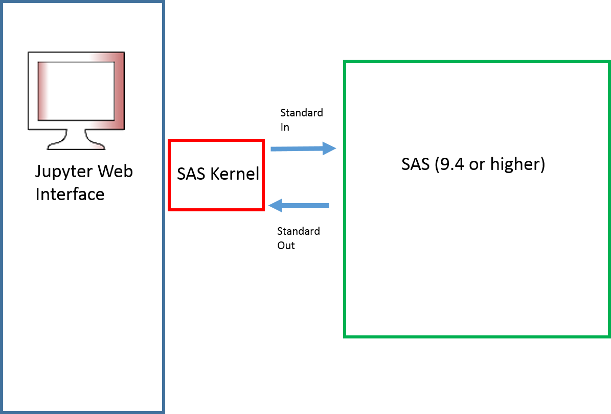

# Project Metis
#### What does Metis mean?
Metis is the moon cloest to Jupiter. It was an internal codename that stuck.

## What is this?

A SAS Kernel for [Jupyter Notebooks](http://www.jupyter.org)

It relies on Python3.X

and integrates or extends the following items:

* Jupyter notebook components
* JupyterHub for multiuser servers
* Jupyter kernel for SAS
* Codemirror mode for SAS
* Theme for SAS
* SAS Extension to show the SAS Log
* NBgrader for academic use of Juypter

## Architecture

* Jupyter notebook is a framework that allows users to submit code to a computational engine (Kernel) and display results inline
* The SAS Kernel is a few hundred lines of python code that facilitates communication between the Jupyter notebook and SAS
* SAS communicates with the SAS Kernel through stdin, stdout, and stderr using the ODS HTML5 engine
* The SAS Kernel has no use without access to SAS

## Install
To successfully use the SAS Kernel you must have each of the following:
* [SAS version 9.4 or above](http://www.sas.com)
* [Jupyter](http://jupyter.org)

    * Jupyter has a number of dependencies. The quickest path to get up and running, in my opinion, is to use [Anaconda Python](http://docs.continuum.io/anaconda/index)
* [Python 3](http://www.python.org)

## Improving Usability
There are a few NBExtensions that have been created to make working with Juypter notebooks more productive. These are largely the result of pain points from my use of SAS Kernel for programming tasks. The extensions can be found [here](). The list includes:
* SAS Log -- which show the SAS log for the last executed cell or the entire log since the last (re)start of the notebook
* SAS Explore -- which gives a list of the assigned libraries (LIBNAMES) and the DATA Sets (MEMNAME) within them.
* SAS Tasks -- 

## Jupyterhub

## NBGrader

## FAQ
* Is there a SAS Magic that I can access from a python kernel?

    Yes! There are actually several cell magics available from SAS. 
    They are `%%SAS`, `%%IML`, `%%SQL` (which uses SAS SQL), and `%%OPTMODEL`. To load these magics in your notebook, execute the following command `%load_ext sas_magic`. You can check that the magics have are successfully activated by looking at the results of `%lsmagic` and looking in the cell magic section.
    If you use multiple SAS Cell magics in the *same* notebook they will share a SAS session (have the same WORK libname and MACROS). There is currently no sharing of SAS Sessions between different notebooks.

* Do I need to buy SAS to use this kernel?

   The SAS Kernel is simply a gateway for Jupyter notebooks to talk to SAS, as such, if SAS is not installed this kernel won't be that helpful. For information on purchasing SAS [click here](http://www.sas.com/en_us/software/how-to-buy.html)

* How does Jupyter communicate with SAS?

    Behind a Jupyter notebook is a python session, that python session submits code to SAS and receives responses through socket i/o (leveraging stdin , stdout, and stderr) which has been supported in SAS for a long time

* If stdin, stdout, and stderr have been supported for so long why do I need to have SAS 9.4 or newer?

    First, SAS 9.4 was released in July 2013 so it isn't exactly a bleeding edge requirement. The reason for a prerequisite for SAS 9.4 is because that was the first release that supported the creation of HTML5 documents and that is the returned output so that we can render attractive tables and graphs automagically

* How can I see my SAS log, I only see the listing output?

    SAS is different from many other programming languages in that it has two useful information streams, the log (which details the technical details of what happened and how long it took) and the lst (which includes the tables and graphics from the analysis).  The SAS Kernel attempts to show you I *think* you want.  Here are the rules:

LOG Has Errors|LST|DISPLAYED| NOTES
--- | --- |--- | ---
No | No  | LOG | This happens when you run DATA Step or a PROC with the `noprint` option
No | Yes |LST |
Yes| Yes | LST & LOG| ERROR messages with context from the log, then the listing output
Yes| No  | LOG|

    If you want to see the log but it was not displayed you can use [SASLog NBExtension]() which will show the log for the last executed cell or the entire log since the last (re)start of the notebook

* Will this leave a bunch of SAS sessions hanging around?

    A SAS session is started for each notebook you have open i.e. 5 notebooks open = 5 SAS sessions. Those sessions will remain active for the life of the notebook. If you shutdown your notebook, the SAS session will also terminate. In Jupyterhub, there are configuration options to shutdown inactive sessions and the SAS kernel complies with those directives.

* I restarted my SAS Kernel and now my WORK library is now empty. What happened?

    When you restart the kernel in a notebook you are terminating the current SAS session and starting a new one. All of the temporary artifacts, datasets in the WORK library, assigned libnames, filename, WORK macros, and so on are destroyed.
