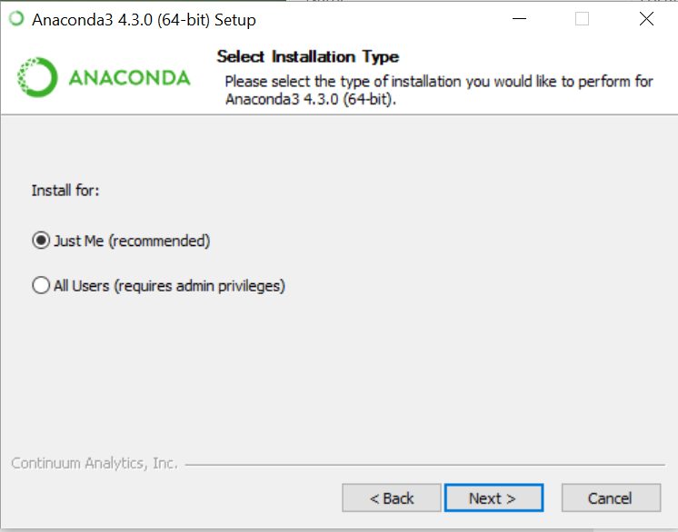

.. Copyright SAS Institute

Installing the SAS Kernel
=========================

The SASPy package installs just like any other Python package.
It is a pure Python package and works with Python 3.3+
installations.  To install using `pip`, you execute the following::

    pip install sas_kernel
    pip install http://github.com/sassoftware/sas_kernel/releases/sas_kernel-X.X.X.tar.gz

Dependencies
------------

-  Python3.X
-  Jupyter
-  SAS 9.4 (released Jul 2013) or higher -- This includes `SAS
   Viya <http://www.sas.com/en_us/software/viya.html>`__

**Note that in prior releases there was a dependency on Linux, that has been removed.
You can now connect to any SAS platform (Unix, Windows, Mainframe)**

Install
-------

To successfully use the SAS Kernel you must have each of the following:
\* `SAS version 9.4 or above <http://www.sas.com>`__ \*
`Jupyter <http://jupyter.org>`__ \* Jupyter has a number of
dependencies. See the subsections for steps on installing Jupyter on
your system. \* `Python 3 <http://www.python.org>`__

Linux Install for Anaconda Python (assuming SAS already installed)
~~~~~~~~~~~~~~~~~~~~~~~~~~~~~~~~~~~~~~~~~~~~~~~~~~~~~~~~~~~~~~~~~~

1. `Download <https://www.continuum.io/downloads>`__ and install
   Anaconda Python (make sure you get Python3.X). If you install
   Anaconda without super user rights (root or sudo) then other users on
   the system will not be able to access the SAS kernel. A couple notes
   that I've observed:

-  The default install location is the users home directory. This is
   fine for a single user install I would put it in a common location
   (``/opt``) if you're doing a system wide install
-  One of the prompts is to add the path to your environment. I
   recommend you want to answer 'yes' to that question so that all the
   installing user has the executables in their path. If you're doing a
   system wide install (root or sudo) all the other users should add
   that path to their environmental variables

1. Install sas\_kernel. The sas\_kernel has a dependency on saspy which
   is located `here <https://github.com/sassoftware/saspy>`__. In the
   command below I'm assuming that ``pip`` maps to python3 if that is
   not the case the you might need to use ``pip3`` instead.
   ``pip install sas_kernel``

2. Verify that the sas\_kernel is installed ``jupyter kernelspec list``

   If you installed as a superuser, your output should similar to this:

   ::

       Available kernels:
         python3    /opt/Anaconda3-2.5.0/lib/python3.5/site-packages/ipykernel/resources
         sas        /usr/local/share/jupyter/kernels/sas

   If you installed as a regular user (sas in this case), your output
   should similar to this:

   ::

       Available kernels:
         python3    /home/sas/anaconda3/lib/python3.5/site-packages/ipykernel/resources
         sas        /home/sas/.local/share/jupyter/kernels/sas

3. Verify SAS Executable is correct

   1. find the sascfg.py file -- it is currently located in the install
      location (see above)
      ``[install location]/site-packages/saspy/sascfg.py`` This command
      will search the OS for the file location:
      ``find / -name sascfg.py``
   2. edit the file with the correct path the SAS executable and include
      any options you wish it include in the SAS invocation. See
      examples in the
      `file <https://github.com/sassoftware/saspy/blob/master/saspy/sascfg.py>`__

Linux Install for Centos 6 (assuming SAS already installed)
~~~~~~~~~~~~~~~~~~~~~~~~~~~~~~~~~~~~~~~~~~~~~~~~~~~~~~~~~~~

These instructions assume you'll be installed system wide for all users
using a superuser account (root or sudo)

1. yum packages
   ``sudo yum install https://centos6.iuscommunity.org/ius-release.rpm    sudo yum install python35u gcc-c++ python35u-devel python35u-pip python35u-tools``

2. pip
   ``wget https://bootstrap.pypa.io/get-pip.py    python3.5 get-pip.py    pip3 --version``

3. jupyter and sas\_kernel. The sas\_kernel has a dependency on saspy
   which is located `here <https://github.com/sassoftware/saspy>`__.
   ``pip3.5 install jupyter    pip3.5 install sas_kernel``

4. Verify that the sas\_kernel is installed ``jupyter kernelspec list``

   This should produce output similar to this:

   ::

       Available kernels:
         python3    /usr/lib/python3.5/site-packages/ipykernel/resources
         sas        /usr/local/share/jupyter/kernels/sas

5. Verify SAS Executable is correct

   1. find the sascfg.py file -- it is currently located in the
      site-packages area of python install ``find / -name sascfg.py``
   2. edit the file with the correct path the SAS executable and include
      any options you wish it include in the SAS invocation. See
      examples in the file

Windows Install (assuming SAS already installed)
~~~~~~~~~~~~~~~~~~~~~~~~~~~~~~~~~~~~~~~~~~~~~~~~

1. `Download <https://www.continuum.io/downloads>`__ and install
   Anaconda Python (make sure you get Python3.X). If you install
   Anaconda admin rights then other users on
   the system will not be able to access the SAS kernel. A couple notes
   that I've observed:

-  I would install in the default location unless you have a good reason to move it.
   It will cut down on headaches later.

.. image:: ./images/ap3.PNG
    :scale: 50%

-  One of the prompts is to make Python accessible to just the installing user or all users.
   Select the best response for you situation.

-  Another of the prompts is to add the path to your environment. I
   recommend you want to answer 'yes' to that question to make it easier to
   start python and Jupyter.

.. image:: ./images/ap4.PNG
    :scale: 50%

**This next section of steps will be performed from the command windows
Start --> Run --> cmd**

1. Install sas\_kernel. The sas\_kernel has a dependency on saspy which
   is located `here <https://github.com/sassoftware/saspy>`__. In the
   command below I'm assuming that ``pip`` maps to python3 if that is
   not the case the you might need to use ``pip3`` instead.
   ``pip install sas_kernel``

2. Verify that the sas\_kernel is installed ``jupyter kernelspec list``

This should produce output similar to this:

   ::

       Available kernels:
         python3    C:\Users\jadean\AppData\Local\Continuum\Anaconda3\lib\site-packages\ipykernel\resources
         sas        C:\ProgramData\jupyter\kernels\sas

5. Verify SAS Executable is correct

   1. find the sascfg.py file -- it is located in the site-packages area of python install.
      Here is the default location ``C:\ProgramData\Anaconda3\Lib\site-packages``
      You can also search the file system for the file.
   2. edit the file with the correct path the SAS executable and include
      any options you wish it include in the SAS invocation. See
      examples in the file.

OSX (Mac) Install
~~~~~~~~~~~~~~~~~

1. `Download <https://www.continuum.io/downloads>`__ and install
   Anaconda Python (make sure you get Python3.X). If you install
   Anaconda admin rights then other users on
   the system will not be able to access the SAS kernel. A couple notes
   that I've observed:

-  I would install in the default location unless you have a good reason to move it.
   It will cut down on headaches later.
-  One of the prompts is to make Python accessible to just the installing user or all users.
   Select the best response for you situation.
-  Another of the prompts is to add the path to your environment. I
   recommend you want to answer 'yes' to that question to make it easier to
   start python and Jupyter.

1. Install sas\_kernel. The sas\_kernel has a dependency on saspy which
   is located `here <https://github.com/sassoftware/saspy>`__. In the
   command below I'm assuming that ``pip`` maps to python3 if that is
   not the case the you might need to use ``pip3`` instead.
   ``pip install sas_kernel``

2. Verify that the sas\_kernel is installed ``jupyter kernelspec list``

This should produce output similar to this:

   ::

       Available kernels:
          python3              /Users/jadean/anaconda3/lib/python3.5/site-packages/ipykernel/resources
          sas                  /usr/local/share/jupyter/kernels/sas

5. Verify SAS Executable is correct

   1. find the sascfg.py file -- it is currently located in the
      site-packages area of python install ``find / -name sascfg.py``

**NOTE:** For OSX the only supported configuration is through the
`IOM interface <http://support.sas.com/documentation/cdl/en/itechov/64881/HTML/default/viewer.htm#titlepage.htm>`__
so you will need use the IOM template in `sascfg.py`

Installing SAS NBextensions
===========================

Installing from PyPi
--------------------

With the release of Jupyter 4.2 (sas\_kernel version 1.2) you can now
install and enable nbextensions in a much improved way. To install and
enable the showSASLog extension use the following command:

::

    jupyter nbextension install --py sas_kernel.showSASLog
    jupyter nbextension enable sas_kernel.showSASLog --py

To install and enable the theme extension use the following command:

::

    jupyter nbextension install --py sas_kernel.theme
    jupyter nbextension enable sas_kernel.theme --py

To verify the ebextensions you have installed use the following command:

::

    jupyter nbextension list

If the extensions are correctly installed you will see output similar to
this:

::

    Known nbextensions:
      config dir: /root/.jupyter/nbconfig
        notebook section
          showSASLog/main  enabled
          - Validating: OK
          theme/theme_selector  enabled
          - Validating: OK

Installing from a cloned repository
-----------------------------------

In your cloned repo you have a directory for each nbextension within the
file structure as shown below:

::

    sas_kernel
    |
    +-- showSASLog
    +-- theme

Extensions are installed from the command line. To install it systemwide
use the following command (you must be root or have sudo privileges).
This assumes you’re in the nbextensions directory otherwise adjust your
path.

::

    jupyter nbextension install ./showSASLog

Which should display something similar to this (if you have super user
rights):

``copying showSASLog/main.js -> /usr/local/share/jupyter/nbextensions/main.js``

To install for the current user only use the following command. Again
assumes you’re in the nbextensions directory otherwise adjust your path.

::

    jupyter nbextension install ./showSASLog --user

Which should display something similar to this (if you DO NOT have super
user rights):

``copying showSASLog/main.js -> /home/sas/.local/share/jupyter/nbextensions/showSASLog/main.js``

Then enable the notebook extension with the following command:

::

    jupyter nbextension enable showSASLog

To disable (not that you’d ever want to):

``jupyter nbextension disable showSASLog``

Example
-------

There is a `notebook`_ that walks through the steps to install and
enable the extensions

.. _notebook: https://github.com/sassoftware/sas_kernel/blob/master/notebook/loadSASExtensions.ipynb